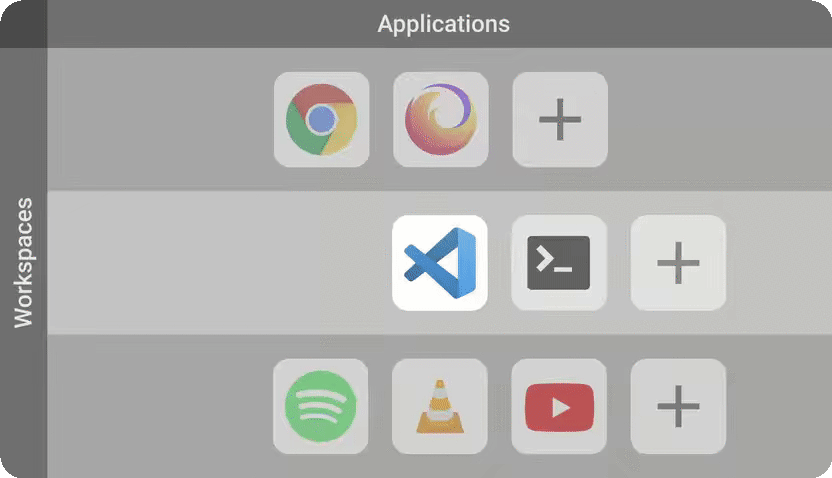

---

Veshell is an innovative not-desktop environment for Linux made with modern technologies like Flutter and Rust.

Designed to simplify navigation and reduce the need to manipulate windows in order to improve productivity. It's meant to be 100% predictable.

It provides an [innovative workflow](#the-innovative-workflow) that utilizes humans natural spatial cognition to enhance navigation and organization in the digital environment.

# Support the project
This project is under the umbrella of the [Free Explorers Collective](https://free-explorers.com), a community of Open Source enthusiast that funds and collaborate on Open Source software. 
By becoming a Free Explorer you can get involve into the project and support it.

# Installation

Veshell is distributed through community channels; there is no vendor repository.

## Arch / Manjaro (AUR)

Three packages are available: `veshell` (builds from source), `veshell-bin`
(prebuilt) and `veshell-git` (tracks development). Install one of them with an
AUR helper, for example:

```sh
yay -S veshell-bin
```

## Fedora (COPR)

```sh
sudo dnf copr enable @free-explorers/veshell
sudo dnf install veshell-bin
```

## openSUSE Tumbleweed, Slowroll and Leap 16.0 (OBS)

```sh
sudo zypper addrepo -f \
  https://download.opensuse.org/repositories/home:/PapyElGringo/openSUSE_Tumbleweed/ veshell
sudo zypper --gpg-auto-import-keys refresh
sudo zypper install veshell-bin
```

Use `openSUSE_Slowroll` or `16.0` instead of `openSUSE_Tumbleweed` on those
releases.

## Debian 13 and Ubuntu 26.04 (OBS)

```sh
sudo install -d -m 0755 /etc/apt/keyrings
curl -fsSL https://download.opensuse.org/repositories/home:/PapyElGringo/xUbuntu_26.04/Release.key \
  | sudo gpg --batch --no-tty --yes --dearmor -o /etc/apt/keyrings/veshell.gpg
echo "deb [signed-by=/etc/apt/keyrings/veshell.gpg] https://download.opensuse.org/repositories/home:/PapyElGringo/xUbuntu_26.04/ ./" \
  | sudo tee /etc/apt/sources.list.d/veshell.list
sudo apt update && sudo apt install veshell-bin
```

Use `Debian_13` instead of `xUbuntu_26.04` on Debian.

## NixOS

See [NixOS packaging](docs/nixos.md).

The project ships no analytics; see
[privacy and telemetry](docs/privacy.md) for the build-time tooling and artifact
provenance.

# Building from source

These instructions need the full toolchain; none of it is required to install a
distribution package.

## Build requirements

- Rust and Cargo via [rustup](https://rustup.rs/)
- [System dependencies](./docs/dependencies.md)

## Trying Veshell

```sh
cargo run
```

## Installing a local build

`make install-local` builds and then installs system-wide (`sudo make install`
with `PREFIX=/usr`):

```sh
make install-local
```

Remove it again with:

```sh
sudo make uninstall
```

This only removes a `make install-local` tree; it never touches a distribution
package. For offline builds and staged installs, see
[the build and packaging guide](docs/building.md). Distribution packaging and
prebuilt releases live in
[`veshell-packaging`](https://github.com/free-explorers/veshell-packaging).

# The innovative workflow

The workflow is designed to synergize with your spatial awareness in order to provide a most intuitive and ergonomic navigation and organization in the digital environment.

Organize all your applications in a two-dimensional space where you can group them by use-cases, categories or or any other criteria that makes sense to you.

<br/>
<p align="center" valign="middle">
 
</p>
<br/>

The persistence feature automatically saves your layout and organization on-the-fly, so you can build your own configuration that persists even after a reboot by simply using it.

Navigate through your tailored environment with ease, using super intuitive directional inputs inspired by the video game industry.

The Material Design Interface does not only enhances the visual appeal, but also provides an at-a-glance view of the whole layout, allowing for easy navigation with a mouse or touchscreen.

The secret of Veshell lies in two human mental mechanisms:

- **Spatial memory**: The ability to remember the layout of a space and the location of objects within it. This allows us to navigate through familiar environments and find our way back to specific locations.

- **Mental mapping**: The ability to create a mental representation of a space and use it to plan routes and navigate through it.

This allow us to use our wayfinding ability to navigate in a effortless and very pleasant way.
